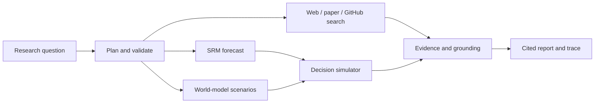

# SRM Forecasting Agent

The SRM Forecasting Agent is an audit-enabled wrapper around the Shape Retrieval Model (SRM). It takes a natural-language request, picks the right data adapter, checks the information boundary, retrieves geometric analog paths, explains the nearest neighbors, and logs everything as JSON audit artifacts. I designed the core logic (information-boundary rules, audit trails, and web workflow); the implementation was built with assistance from Codex/GPT. **We have a paper ready, which will be posted to arXiv soon and submitted to JF.**

```bash
pip install -r requirements.txt
python cli.py "forecast AAPL MSFT NVDA horizon=5 k=20 cross asset"
```

The default Yahoo adapter uses daily closing prices and treats the rolling squared return as a proxy for realized volatility (RV). For publication‑grade RV, point to a directory containing `merged_rv_data_filled.csv` (and optionally `daily_returns.csv`) using the `--csv` flag.

The Streamlit frontend uses the full audited SRM geometry engine (`research_engine/`), which provides five channels (curve, velocity, acceleration, curvature, global geometry), Transformer channel weights, candidate‑boundary checks, and same‑/cross‑asset retrieval. The web layer caches run metadata and shows diagnostics, but it does not alter the core formulas.

## Optional LLM Tool‑Use Prototype

The `llm_agent.py` module is an experimental research prototype for reliable tool calling. It uses a cloud LLM (OpenAI‑compatible, configured via `LLM_BASE_URL`, `LLM_MODEL`, and `MOONSHOT_API_KEY` or `OPENAI_API_KEY`) to translate natural‑language requests into validated `run_srm_forecast` tool calls. The SRM engine remains the sole source of truth for numerical results. Without an API key, the system falls back to a deterministic parser, so the dashboard and tests stay reproducible. Tool traces capture parsed arguments, validation status, backend info, and errors.

The FastAPI endpoint is `POST /api/agent/llm` with a JSON body `{"request": "..."}`. The Streamlit Agent tab exposes the same flow and reports grounded summaries from the SRM outputs.

## Research Boundary

The LLM layer only parses requests, selects tools, validates arguments, and explains results. It never modifies the SRM formulas, training, data audit, or forecasts. Public data mode uses the daily RV proxy; paper‑grade experiments should switch to the research RV adapter.

## Web Dashboard

### Headline Arena (Safe Dry‑Run)

`headline_arena.py` builds a validated, timestamped direction payload for local inspection only. The direction probability must come from an explicit direction model; SRM volatility magnitudes are never implicitly converted. There is no network submission path, and all payloads are marked `dry‑run`.

```bash
python -c 'from headline_arena import build_payload; print(build_payload(target="gold", probability_positive=0.6))'
```

### Research Copilot MVP

The research‑agent layer adds a grounded research loop around the unchanged forecasting engine. `POST /api/research/chat` accepts a natural‑language question and returns a visible plan, tool traces, evidence records, model outputs, and a citation‑grounded answer. Public tools include controlled web search, OpenAlex paper search, SRM forecasting, research decision simulation, and teacher research‑fit cards. `/health`, `/ready`, and `/version` expose deployment status without leaking secrets.

The first world‑model integration is intentionally auditable: it reports the volatility‑world‑model protocol and keeps simulation separate from the SRM engine until an audited checkpoint/config is supplied. Decision simulation is research‑only and never places trades.

## API and Deployment

Run the API locally with `python run_web.py`, or run the research UI with `streamlit run streamlit_app.py`. `/health`, `/ready`, and `/version` are safe to use as deployment probes. Configure a cloud model only through environment variables listed in `.env.example`; no key is required for deterministic fallback mode.

Important endpoints include `POST /api/research/chat`, `POST /api/search/web`, `POST /api/search/papers`, `POST /api/github/inspect`, `POST /api/world‑model/simulate`, `POST /api/decision/evaluate`, and the research‑run and memory lifecycle endpoints. Reports are available as Markdown and JSON. Web pages and repository content are treated as untrusted evidence; the agent never executes remote code, sends email, connects to a broker, or places a real trade.



Install `web_requirements.txt`, then run:

```bash
PYTHONPATH=. python3 run_web.py
```

Open `http://127.0.0.1:8000`. The dashboard supports online delayed market data, one‑, five‑, and 21‑day forecasts, same‑/cross‑asset retrieval, nearest‑path explanations, and forecast visualization. It intentionally does not connect to broker accounts or place real orders. The event‑driven paper simulator is research‑only: it uses virtual portfolios, does not connect to brokers, and never places real orders.

