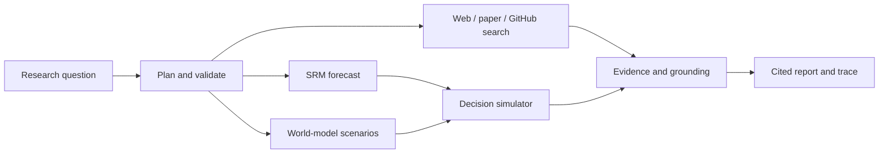

# SRM Forecasting Agent

This is my research project. I designed the SRM agent, its information-boundary
logic, audit artifacts, and web workflow; the implementation was developed with
assistance from Codex/GPT. A manuscript is being prepared for arXiv submission.

An auditable agent wrapper around the Shape Retrieval Model. It parses a natural-language request, selects a data adapter, validates the information boundary, retrieves geometric analog paths, explains the neighbors, and saves JSON audit artifacts.

```bash
pip install -r requirements.txt
python cli.py "forecast AAPL MSFT NVDA horizon=5 k=20 cross asset"
```

The Yahoo adapter uses daily closing prices and labels its rolling squared-return measure as an RV proxy. For publication-grade realized volatility, pass a directory containing `merged_rv_data_filled.csv` and optionally `daily_returns.csv` with `--csv`.

The deployed Streamlit entrypoint uses the full audited SRM geometry engine (`research_engine/`): five channels (curve, velocity, acceleration, curvature, global geometry), Transformer channel weights, candidate-boundary checks, and target-specific same/cross-asset retrieval. The web layer caches run metadata and presents diagnostics without changing the paper formula.

## Optional LLM tool-use prototype

The `llm_agent.py` layer is an optional research prototype for studying reliable
tool use around the unchanged SRM forecasting engine. A cloud OpenAI-compatible
LLM (configured with `LLM_BASE_URL`, `LLM_MODEL`, and `MOONSHOT_API_KEY` or
`OPENAI_API_KEY`) converts a natural-language request into the validated
`run_srm_forecast` tool call. The numerical engine remains the source of truth.

Without an API key, the same interface uses a deterministic parser so the
dashboard and tests remain reproducible. Tool traces record the parsed
arguments, validation status, backend, and errors. This prototype does not
connect to broker accounts, place real orders, or provide investment advice.

The FastAPI endpoint is `POST /api/agent/llm` with JSON `{ "request": "..." }`.
The Streamlit Agent tab exposes the same flow and reports grounded summaries
from the returned SRM values.

## Research boundary

The LLM layer only handles request parsing, tool selection, argument validation,
and result explanation. It does not alter the SRM formulas, training protocol,
data audit, or reported forecasting results. The public-data mode uses a daily
RV proxy; paper-grade experiments should use the research RV adapter.

## Web dashboard

## Headline Arena (safe dry-run)

`headline_arena.py` builds a validated, timestamp-locked direction payload for
local inspection only. The direction probability must come from an explicit
direction model; SRM volatility magnitudes are never converted implicitly.
There is no network submission path in this repository, and the payload is
always marked `dry-run`.

```bash
python -c 'from headline_arena import build_payload; print(build_payload(target="gold", probability_positive=0.6))'
```

## Research copilot MVP

The research-agent layer adds a grounded research loop around the unchanged
forecasting engine. `POST /api/research/chat` accepts a natural-language
question and returns a visible plan, tool trace, evidence records, model
outputs, and a citation-grounded answer. The public tools include controlled
web search, OpenAlex paper search, SRM forecasting, research decision
simulation, and teacher research-fit cards. `/health`, `/ready`, and `/version`
expose deployment status without revealing secrets.

The first world-model integration is intentionally auditable: it reports the
volatility-world-model protocol and keeps simulation execution separate from
the SRM engine until an audited checkpoint/config is supplied. Decision
simulation is research-only and never places trades.

## API and deployment

Run the API locally with `python run_web.py`, or run the research UI with
`streamlit run streamlit_app.py`. `/health`, `/ready`, and `/version` are safe
to use as deployment probes. Configure a cloud model only through environment
variables listed in `.env.example`; no key is required for deterministic
fallback mode.

Important endpoints include `POST /api/research/chat`, `POST /api/search/web`,
`POST /api/search/papers`, `POST /api/github/inspect`,
`POST /api/world-model/simulate`, `POST /api/decision/evaluate`, and the
research-run and memory lifecycle endpoints. Reports are available as Markdown
and JSON. Web pages and repository content are treated as untrusted evidence;
the agent never executes remote code, sends email, connects to a broker, or
places a real trade.



Install `web_requirements.txt`, then run:

```bash
PYTHONPATH=. python3 run_web.py
```

Open `http://127.0.0.1:8000`. The dashboard supports online delayed market data, one-, five-, and 21-day forecasts, same-asset/cross-asset retrieval, nearest-path explanations, and forecast visualization. It intentionally does not connect to broker accounts or place real orders. The event-driven paper simulator is research-only: it uses virtual portfolios, does not connect to brokers, and never places real orders.
